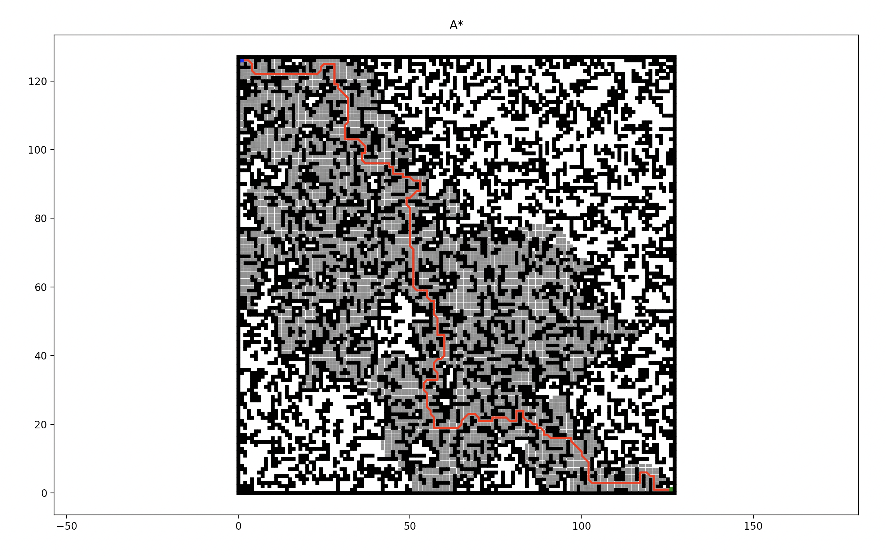

# Advance-path-planning-algorithms-on-2D-Grid
1. Implementation of Search Based algorithms on randomly generated 2D grid. 
2. Implementation of Sampling based motion planning algorithms on Campus map.

# Testing the code
While in repository folder, run the command python3 2DPlanning/Search_2D/Best_First.py \
inside the informed_RRT folder, run the command python main.py

# Results

